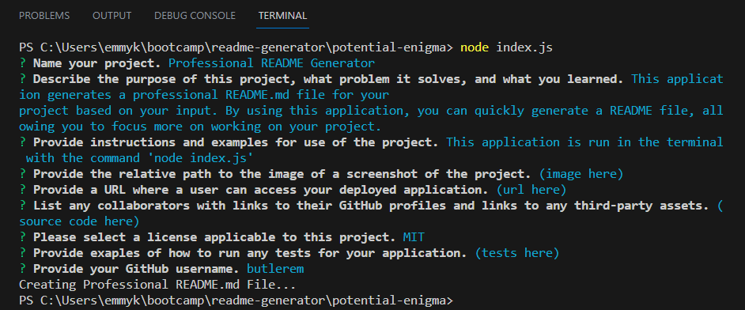

# Professional README Generator 

## Description
This project is a command-line application that generates a professional README.md file for the user's application repository. The user is prompted to input the project title, description, usage information, license, credits, and test instructions, which will all be automatically added to their respective sections of the README. The README will also include a license badge and notice.

## Usage
This application is run from the command line. You will be prompted to provide information about your application repository. Once all the required information is provided, the application will generate a README.md file in the folder.

## License
This project is licensed under the MIT License.
https://opensource.org/licenses/MIT

## Credits
The source code for this project can be found at https://github.com/coding-boot-camp/potential-enigma.git

## Testing
The demonstration video is available here:

https://drive.google.com/file/d/1_4zZCIb3wnIxapnPh2aholFA7c33UO3p/view?usp=sharing

## Questions
Please send any questions to [github/butlerem](https://github.com/butlerem).

🌼
